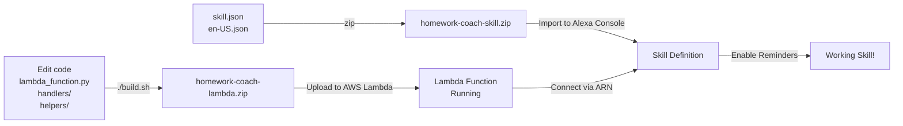

# Upload Guide - Everything You Need

## 📦 What to Upload & Where

All files you need to upload are **in this `lambda/` folder**.

### 1. AWS Lambda - The Code

**File to upload**: `homework-coach-lambda.zip` (created by `./build.sh`)

```bash
# Step 1: Build the package
cd lambda/
./build.sh

# Step 2: Upload to AWS Lambda
# Option A: AWS CLI
aws lambda update-function-code \
  --function-name HomeworkCoachSkill \
  --zip-file fileb://homework-coach-lambda.zip

# Option B: AWS Console
# Go to Lambda → Your Function → Upload ZIP
```

**Contents of ZIP**:
```
homework-coach-lambda.zip
├── lambda_function.py               # Main handler
├── handlers/                        # Extra handlers
├── helpers/                         # Business logic + DynamoDB + Reminders
├── skill-package/                   # Skill files (optional in ZIP, for reference)
├── ask_sdk_core/                    # Python dependencies
├── boto3/
├── requests/
└── ... other dependencies
```

---

### 2. Alexa Developer Console - The Skill Definition

**Files to upload**: 
- `skill-package/skill.json`
- `skill-package/interactionModels/custom/en-US.json`

#### Option A: Upload as ZIP to Alexa Console

```bash
# Create skill ZIP from lambda directory
cd lambda/
zip -r ../homework-coach-skill.zip \
  skill-package/skill.json \
  skill-package/interactionModels/

# Then import to Alexa Developer Console
# Build tab → Import Skill → Upload zip
```

**Contents of skill ZIP**:
```
homework-coach-skill.zip
├── skill.json                       # Manifest (metadata, Lambda ARN, permissions)
└── interactionModels/custom/
    └── en-US.json                   # Intents, slots, utterances, dialog config
```

#### Option B: Manual Upload

**In Alexa Developer Console:**

1. Go to **Build** tab → **JSON Editor**
2. Open `lambda/skill-package/skill.json` in a text editor
3. Copy entire contents → Paste into JSON Editor
4. Save

Then:

1. Go to **Interaction Model** section
2. Open `lambda/skill-package/interactionModels/custom/en-US.json` in text editor
3. Copy entire contents → Paste into Interaction Model JSON Editor
4. **Build Model**

#### Option C: ASK CLI (Automated)

```bash
# If you have ASK CLI installed
cd lambda/skill-package/
ask deploy
```

---

## 🎯 Complete Workflow



---

## 📋 File Locations in lambda/ Folder

```
lambda/
├── lambda_function.py              ← Main handler code
├── handlers/
│   └── additional_handlers.py      ← Extra intent handlers
├── helpers/
│   ├── algorithms.py              ← Planning, Pomodoro, SR, recap logic
│   ├── dynamodb_helper.py         ← DynamoDB operations
│   ├── reminders_helper.py        ← Reminders API calls
│   └── apl_helper.py              ← Echo Show display formatting
│
├── skill-package/                 ← **UPLOAD THESE TO ALEXA CONSOLE**
│   ├── skill.json                 ← Skill manifest (metadata, Lambda ARN, permissions)
│   └── interactionModels/custom/
│       └── en-US.json             ← Interaction model (intents, slots, utterances)
│
├── requirements.txt               ← Python dependencies (boto3, ask-sdk-core, etc.)
├── build.sh                       ← Script that creates homework-coach-lambda.zip
├── README_DEPLOYMENT.md           ← Full deployment instructions
├── UPLOAD_GUIDE.md                ← This file
└── README.md                      ← Legacy README
```

---

## ✅ Quick Checklist

- [ ] **AWS Lambda Upload**
  - [ ] Run `./build.sh` in lambda/ folder
  - [ ] Upload `homework-coach-lambda.zip` to AWS Lambda
  - [ ] Verify Lambda ARN shows in console

- [ ] **Alexa Console Upload**
  - [ ] Upload skill-package to Alexa Developer Console
  - [ ] Verify skill.json and en-US.json imported correctly
  - [ ] In Console → Endpoint → Paste Lambda ARN
  - [ ] In Console → Permissions → Enable Reminders
  - [ ] Build Model successfully

- [ ] **Testing**
  - [ ] Test in Alexa Console simulator
  - [ ] Test on physical Echo device (if available)

---

## 🔗 Key Files Reference

| To Upload | File | Upload To |
|-----------|------|-----------|
| **Lambda code** | `homework-coach-lambda.zip` | AWS Lambda service |
| **Skill manifest** | `skill-package/skill.json` | Alexa Console (via JSON Editor or ZIP import) |
| **Intents & slots** | `skill-package/interactionModels/custom/en-US.json` | Alexa Console (via JSON Editor or ZIP import) |

---

## ❓ Common Questions

**Q: Can I upload just the Python files?**
A: No, AWS Lambda needs a ZIP with `lambda_function.py` at the root (not in a subfolder). Use `./build.sh` to create the correct structure.

**Q: Do I upload the skill-package to Lambda?**
A: It's included in `homework-coach-lambda.zip` for reference, but the main upload goes to AWS Lambda. The skill definition (skill.json + en-US.json) is uploaded separately to Alexa Console.

**Q: What if I just have `homework-coach-lambda.zip`?**
A: Extract it and look for `skill-package/` inside. Or re-run `./build.sh` from the lambda directory.

**Q: Can I edit skill.json and en-US.json inside the ZIP?**
A: Not recommended. Edit the originals in `lambda/skill-package/`, then rebuild the ZIPs.

---

## 🚀 Next Steps

1. **Build**: Run `./build.sh`
2. **Deploy Lambda**: Upload `homework-coach-lambda.zip` to AWS Lambda
3. **Deploy Skill**: Upload skill files to Alexa Console
4. **Connect**: Put Lambda ARN in Alexa Console endpoint
5. **Test**: Say "Alexa, open Homework Coach"

See `README_DEPLOYMENT.md` for detailed step-by-step instructions.
